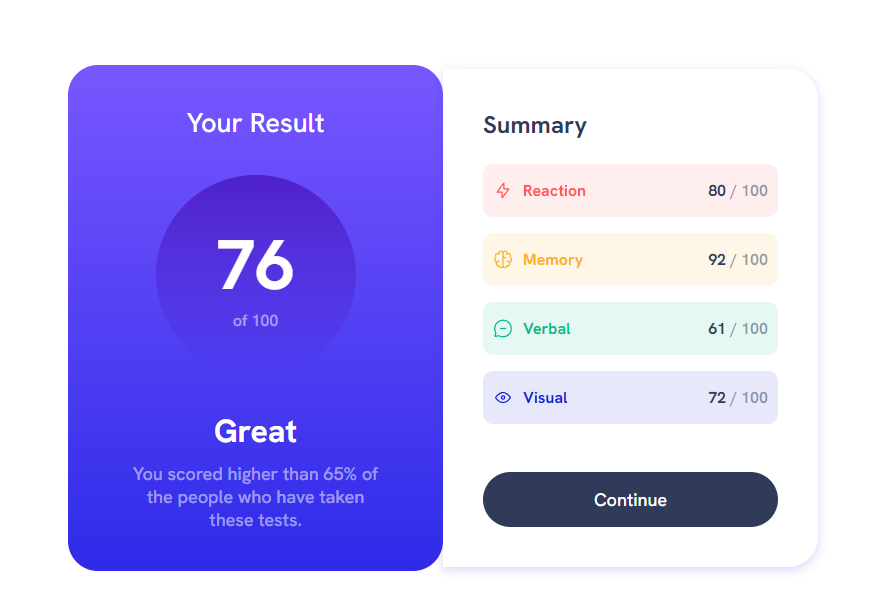

# Frontend Mentor - Results summary component solution

This is a solution to the [Results summary component challenge on Frontend Mentor](https://www.frontendmentor.io/challenges/results-summary-component-CE_K6s0maV). Frontend Mentor challenges help you improve your coding skills by building realistic projects. 

## Table of contents

- [Overview](#overview)
  - [The challenge](#the-challenge)
  - [Screenshot](#screenshot)
- [My process](#my-process)
  - [Built with](#built-with)
  - [What I learned](#what-i-learned)
- [Author](#author)
- [Acknowledgments](#acknowledgments)


## Overview

### The challenge

Users should be able to:

- View the optimal layout for the interface depending on their device's screen size
- See hover and focus states for all interactive elements on the page

### Screenshot




## My process

### Built with

- Semantic HTML5 markup
- CSS custom properties
- Flexbox

### What I learned

I used to have some difficulty with the media query and here I had the opportunity to practice it the easy way.

Using the following code I was able to work with media query and practice responsive design:

```css
@media (max-width: 375px) {
  #component-container {
    display: block;
  }
}
```
## Author

- Linkedin - [Marcus Tourinho](https://www.linkedin.com/in/marcus-tourinho/)

## Acknowledgments

Here I didn't use the mobile first concept and it was a mistake.
